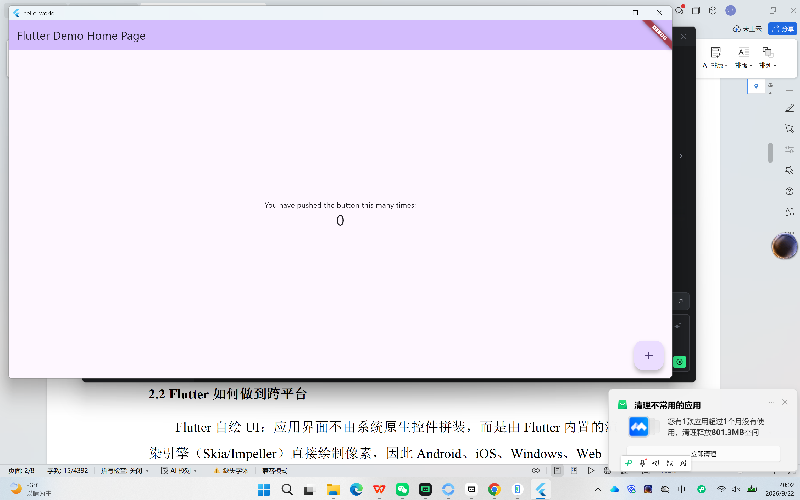
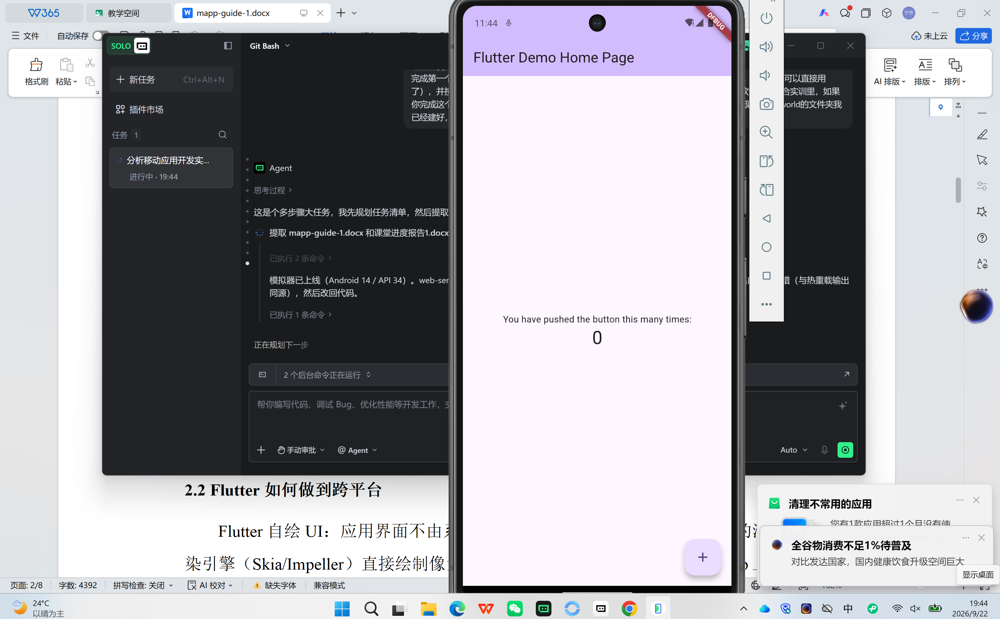

# hello_world

我的第一个 Flutter 应用 —— 《移动应用软件开发实训》课堂案例复现。

功能：Flutter 官方计数器示例，点击右下角加号按钮，屏幕中央的数字加 1。

## 运行环境

- Flutter 3.47.4 (stable) / Dart 3.13.3
- 已验证平台：Web（Chrome/Edge）、Android 模拟器（Pixel 7，Android 14 / API 34）、Windows 桌面

## 运行方式

```bash
flutter pub get          # 拉取依赖
flutter devices           # 查看可用设备
flutter run -d chrome     # Web 端运行
flutter run -d emulator-5554   # Android 模拟器运行（设备ID以 flutter devices 为准）
flutter run -d windows    # Windows 桌面端运行
```

运行后在终端按 `r` 热重载、`R` 热重启、`q` 退出。

> 注意：本项目曾放在含中文的目录下，Android 构建需在 `android/gradle.properties` 中保留
> `android.overridePathCheck=true`；建议新项目使用不含中文与空格的路径。

## 多端运行截图

### Web 端



### Android 模拟器（Pixel 7）



## 目录结构

- `lib/main.dart`：应用入口与计数器页面代码
- `docs/`：多端运行截图与故意实验报错记录
- `android/`、`web/`、`windows/`：各平台工程

## Git 提交记录

1. `feat: flutter create hello_world` —— 创建项目
2. `feat: run on web and emulator with screenshots` —— 多端运行与截图
3. `docs: add README with run instructions and screenshots` —— README
